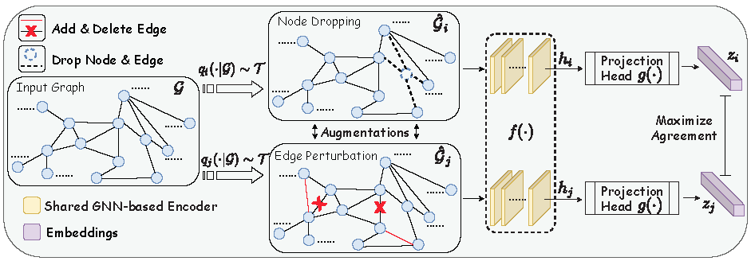

# How Well Do Self-Supervised GNNs Transfer to Knowledge Graphs?

Ailin Deng, Yifan Zhang

CS6216 Project

National University of Singapore


## Overview
Graph representation learning has emerged as a powerful technique for real-world knowledge graph-based problems.  One of the arts on graph representation learning is using graph neural networks, which however require  a large number of labeled data for training and thus may be impractical for real-world applications. To handle this, contrastive self-supervised  learning leverages unlabeled graph data to train graph neural networks (GNNs) via contrastive learning and is attracting increasing attention. However, although there are several contrastive self-supervised  learning studies on the pre-training of GNNs, few have explored their applications to knowledge graph learning tasks. Therefore, in this repository, we empirically explore whether better self-supervised GNNs transfer better in Knowledge Graph-based tasks.

### Graph Contrastive Learning
We use graph contrastive learning framework [GraphCL](https://github.com/Shen-Lab/GraphCL) as basic graph contrastive learning method for empirical studies.

 
 
In GraphCL, there are four kinds of graph-level augmentation techniques: node dropping, edge perturbation, attribute masking, and subgraph.


### TransE

## Experiment Results

*  Effectiveness of Self-supervised Pre-training.

*  Effect of Data Augmentations.

*  Compareness with Supervised Pre-training.


## Citation

If you would like to reference this report in you research, please cite our paper.

```
@inproceedings{nus-cs6216-report,
 author = {Deng, Ailin and Zhang, Yifan},
 booktitle = {NUS CS6216},  
 title = {How Well Do Self-Supervised GNNs Transfer to Knowledge Graphs?}, 
 year = {2021}
}
```

