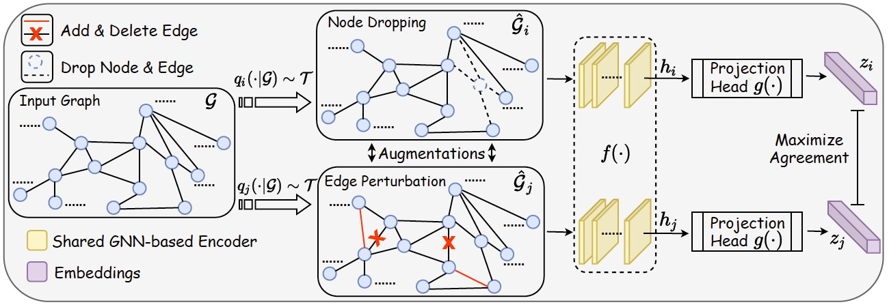
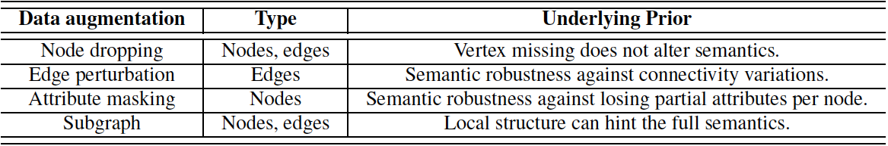
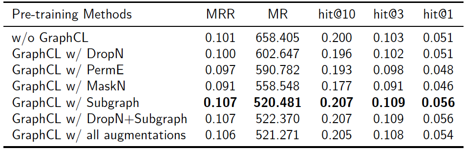

# How Well Do Self-Supervised GNNs Transfer to Knowledge Graphs?
Ailin Deng, Yifan Zhang

CS6216 Project

National University of Singapore


## Overview
Graph representation learning has emerged as a powerful technique for real-world knowledge graph-based problems.  One of the arts on graph representation learning is using graph neural networks, which however require  a large number of labeled data for training and thus may be impractical for real-world applications. To handle this, contrastive self-supervised  learning leverages unlabeled graph data to train graph neural networks (GNNs) via contrastive learning and is attracting increasing attention. However, although there are several contrastive self-supervised  learning studies on the pre-training of GNNs, few have explored their applications to knowledge graph learning tasks. Therefore, in this repository, we empirically explore whether better self-supervised GNNs transfer better in Knowledge Graph-based tasks.

### Graph Contrastive Learning for Pre-training
We use graph contrastive learning framework [GraphCL](https://github.com/Shen-Lab/GraphCL) as basic graph contrastive learning method for empirical studies.

 
 
In GraphCL, there are four kinds of graph-level augmentation techniques: node dropping, edge perturbation, attribute masking, and subgraph.

 

### TransE for Transfer Leanring to Knowledge Graph Tasks
After pre-training graph neural networks on a graph dataset, we then transfer the pre-trained model to solve a downstream link prediction task on knowledge graphs. For each entity, we use a graph neural network (initialized by the GraphCL pre-training parameters) to extract their features. For edge edge, we  randomly initialize their representations. To fine-tuning the GNN, we follow the idea of [TransE](https://proceedings.neurips.cc/paper/2013/file/1cecc7a77928ca8133fa24680a88d2f9-Paper.pdf) that the functional relation introduced by labeled edges represents a translation of their embeddings. To be specific, TransE helps learn lower values of the energy for training triplets than those for corrupted triplets.  


## Experiment Results
*  Dataset: we use the PPI graph dataset for self-supervised pretraining, while we adopt FB15K237 knowledge graph database (a variant of FB15K) for the downstream link prediction.

*  Effectiveness of Self-supervised Pre-training: Contrastive self-supervised pre-training improves  the performance of GNNs on downstream knowledge graph tasks.
 


*  Effect of Data Augmentations: Subgraph is particularly beneficial to the performance on down-stream knowledge graph tasks. Moreover, Node dropping, edge perturbation and node masking do not work for the transfer learning to knowledge graph tasks. Last, GraphCL with all four augmentations performs the best    for the transfer learning to knowledge graph tasks.

 

*  Compareness with Supervised Pre-training:  Supervised pre-training performs better than the self-supervised pre-training under our current experimental settings. Since self-supervised pre-training has shown better performance than supervised pre-training on visual tasks, graph self-supervised learning still requires further improvement.
 


## Main Findings

*  Self-supervised pre-training can benefit knowledge graphs under some augmentations.

*  Different augmentations perform differently. Subgraph is particularly beneficial to the performance on down-stream knowledge graph tasks.

*  Supervised pre-training also enhances the performance of GNNs for knowledge graph tasks.

## Citation

If you would like to reference this report in you research, please cite our paper.

```
@inproceedings{nus-cs6216-report,
 author = {Deng, Ailin and Zhang, Yifan},
 booktitle = {NUS CS6216: https://github.com/Vanint/CS6216-Project},  
 title = {How Well Do Self-Supervised GNNs Transfer to Knowledge Graphs?}, 
 year = {2021}
}
```

